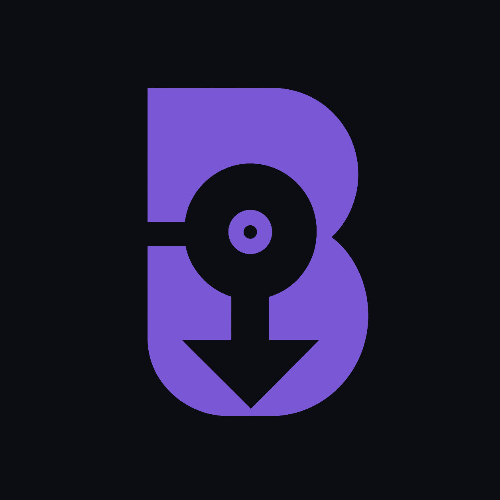

# Batch Beatmap Downloader Community

A community-maintained Windows fork of
[`nzbasic/batch-beatmap-downloader`](https://github.com/nzbasic/batch-beatmap-downloader).
It searches the Batch Beatmap Downloader catalogue, compares results with a
local osu! library, and downloads missing beatmap sets in bulk.

## Download

**[Download Batch Beatmap Downloader Community 1.5.0 for Windows](https://github.com/z9a17/batch-beatmap-downloader/releases/download/v1.5.0/BBDCommunity-Setup-1.5.0.exe)**

The installer supports Windows 10 and 11 on x64 systems and lets you choose the
installation directory.

You do **not** need Node.js, npm, the .NET SDK, or the original Batch Beatmap
Downloader. The installer contains the desktop runtime and the helper used to
read osu!lazer libraries.

The installer is not code-signed, so Windows SmartScreen may show an
unrecognized publisher warning. Release `1.5.0` installer SHA-256:

```text
CA3E63062B71E2FD1E6E18DD1C692A24A20F89EB4E3AA0F83B3371D7005D7B70
```

## What this fork adds

- A redesigned dark blue interface.
- A separate application name, icon, installer, and update identity.
- A selectable Windows installation directory.
- osu!stable and osu!lazer library modes with separate saved paths.
- Read-only detection of beatmaps in osu!lazer's `client.realm`.
- Staged `.osz` importing into osu!lazer.
- Search presets, download queuing, progress controls, and service status.

## Using it

1. Open **Overview**.
2. Choose **osu!stable** or **osu!lazer**.
3. Confirm the detected installation or select it with **Browse**.
4. Open **Discover**, set the filters you want, and run the search.
5. Review the result and add it to **Downloads**.

For osu!stable, select the folder containing `collection.db` and `Songs`.

For osu!lazer, select the data folder containing `client.realm` and the
`osu!.exe` used for imports. Common Windows locations and redirected lazer
storage locations are detected automatically.

## osu!lazer limitations

- Lazer library access is read-only.
- Downloads are staged as `.osz` files and removed only after the imported set
  appears in the lazer library.
- Collection creation and collection comparison are currently available only
  in osu!stable mode.
- Lazer detection and importing are currently supported only on Windows.

## Catalogue and downloads

This fork currently uses the original project's hosted services:

- Metadata and filtering: `https://v2.nzbasic.com`
- Beatmap archives and helper files: `https://direct.nzbasic.com`

Those services and their database are not operated by this fork. Availability
and catalogue coverage therefore depend on the original service.

Developers can point a local build at other services with `BBD_API_URL` and
`BBD_DIRECT_URL`.

## Building from source

This section is for contributors only. Installing the Windows release does not
require any of these tools.

Build requirements:

- Node.js 22
- npm 10
- .NET 8 SDK for the Windows osu!lazer helper

```powershell
cd client
npm ci
npm run build:lazer-reader
npm run typecheck
npm run lint
npm start
```

Create the Windows installer with:

```powershell
npm run make:win
```

## Repository layout

```text
api/       Original Go metadata and filter service
client/    Electron desktop application
download/  Original Go download helper
```

The production database, deployment credentials, and private environment
configuration are not stored in this repository.

## Reporting problems

Use the [GitHub issue tracker](https://github.com/z9a17/batch-beatmap-downloader/issues)
and include the application version, osu! client mode, and the error shown.

## AI assistance

The redesign and modernization of this fork were produced with substantial
generative AI assistance and reviewed by the maintainer.

## License

MIT. The original project history and license are preserved. See
[`LICENSE`](LICENSE).
